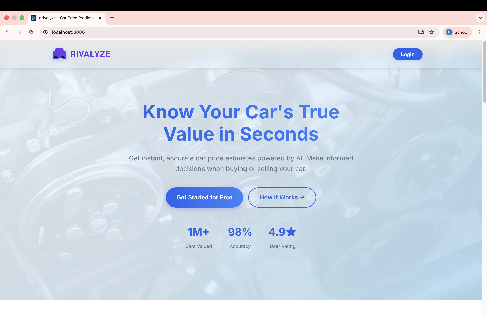
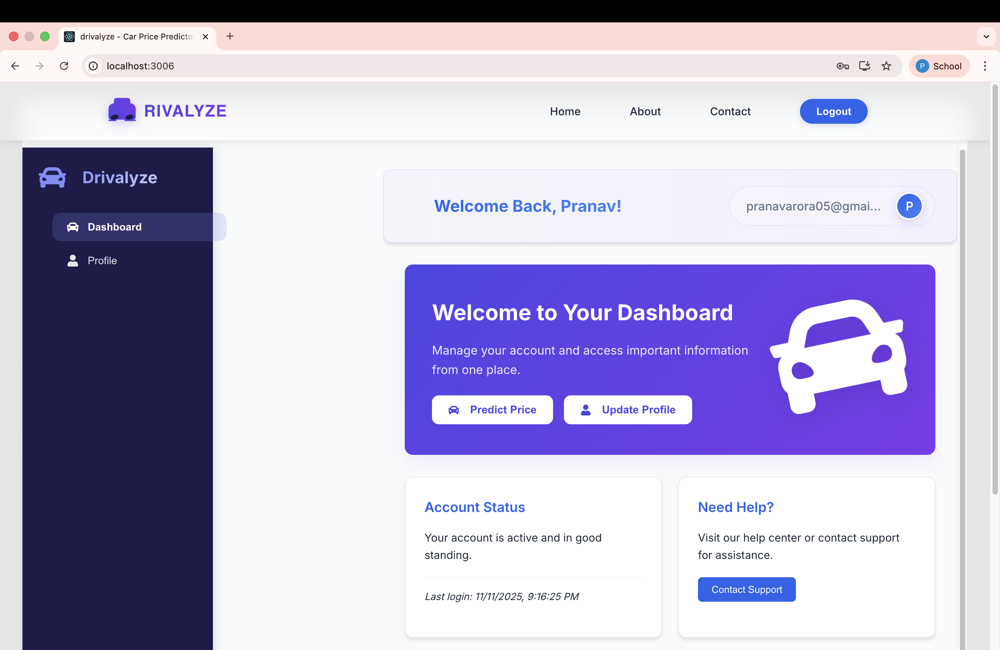
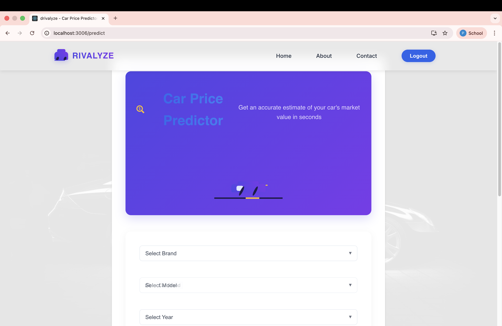
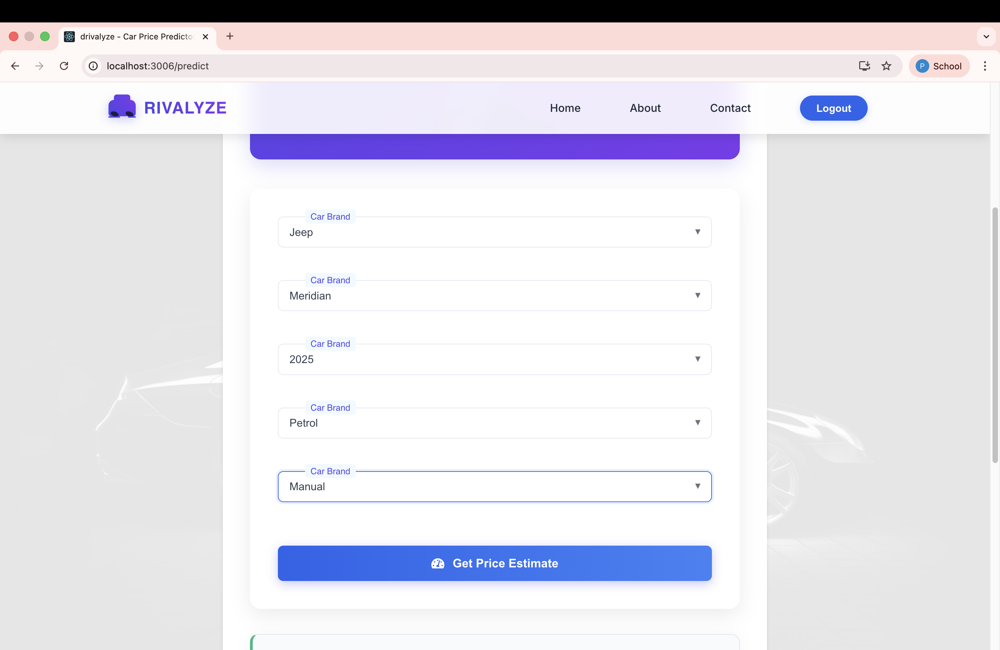

# 🚗 Drivalyze - Intelligent Car Price Prediction System

## 📸 Screenshots

<div align="center">
  <h3>Landing Page</h3>
  
  <p>Welcome to Drivalyze - Your intelligent car price prediction platform</p>
  
  <h3>Login Page</h3>
  
  <p>Secure login to access personalized features and save your predictions</p>
  
  <h3>Dashboard</h3>
  
  <p>Your personalized dashboard with saved predictions and market insights</p>
  
  <h3>Price Prediction</h3>
  
  <p>Get instant price estimates by entering vehicle specifications</p>
  
  <h3>Prediction Results</h3>
  
  <p>Detailed price prediction with confidence scores and market comparison</p>
</div>

## 📌 Overview
Drivalyze is a cutting-edge car price prediction platform that leverages machine learning to provide accurate ex-showroom price estimates for the Indian automotive market. Our system helps both buyers and sellers make informed decisions with data-driven insights.

## ✨ Key Features
- **AI-Powered Price Predictions**: Utilizes advanced machine learning models (Random Forest Regressor) trained on comprehensive market data
- **Comprehensive Vehicle Database**: Covers 400+ car configurations across 14+ leading brands and 48+ models
- **Dynamic Market Analysis**: Real-time price trends and market insights
- **User-Friendly Interface**: Intuitive dashboard with interactive filters and visualizations
- **Data-Driven Insights**: Detailed price breakdowns and market comparisons
- **Responsive Design**: Seamless experience across desktop and mobile devices

## 🛠️ Technical Stack
- **Frontend**: React.js, React Router, Tailwind CSS
- **Backend**: Python, Flask, Flask-CORS
- **Machine Learning**: Scikit-learn, Pandas, NumPy
- **Data Visualization**: Chart.js, React-ChartJS-2
- **Version Control**: Git, GitHub

## 📊 Power BI Integration
- Interactive dashboards for in-depth market analysis
- Real-time data visualization of car price trends
- Comprehensive reports on market performance

## 🚀 Getting Started

### Prerequisites
- Node.js (v14+)
- Python (3.8+)
- pip (Python package manager)

### Installation
1. Clone the repository
2. Set up the backend:
   ```bash
   cd backend
   python -m venv venv
   source venv/bin/activate  # On Windows: venv\Scripts\activate
   pip install -r requirements.txt
   ```
3. Set up the frontend:
   ```bash
   cd ../drivalyze
   npm install
   ```

### Running the Application
1. Start the backend server:
   ```bash
   cd backend
   python app.py
   ```
2. Start the frontend development server:
   ```bash
   cd ../drivalyze
   npm start
   ```
3. Open http://localhost:3006 to view the application

## 📂 Project Structure
```
ADS-Project-2/
├── backend/              # Flask server and ML model
│   ├── data/             # Dataset and model files
│   ├── models/           # ML model and preprocessing
│   ├── app.py            # Main Flask application
│   └── requirements.txt  # Python dependencies
├── drivalyze/            # React frontend
│   ├── public/           # Static files
│   └── src/              # React components and pages
└── screenshots/          # Application screenshots
```

## 📈 Features in Detail

### Smart Price Prediction
- Input vehicle specifications to get instant price estimates
- Compare predicted prices with market averages
- Save and track your predictions

### Market Analysis
- View historical price trends
- Compare models side by side
- Get insights on best value for money

### User Dashboard
- Track your search history
- Save favorite vehicles
- Get personalized recommendations

## 🤝 Contributing
We welcome contributions! Please read our [Contributing Guidelines](CONTRIBUTING.md) for details on our code of conduct and the process for submitting pull requests.

## 📄 License
This project is licensed under the MIT License - see the [LICENSE](LICENSE) file for details.

## 📬 Contact
For any queries or feedback, please reach out to us at [your-email@example.com](mailto:your-email@example.com)

---

<div align="center">
  Made with ❤️ by [Your Name] | [](https://github.com/Pranav29Arora)
</div>

### Backend
- Python 3
- Flask
- scikit-learn (Random Forest Regressor)
- pandas
- numpy

## Project Structure

```
ADS - 2/
├── backend/
│   ├── app.py                 # Flask API server
│   ├── train_model.py         # ML model training script
│   ├── data/
│   │   └── cars_data.csv      # Car dataset
│   ├── models/                # Trained model files
│   └── requirements.txt       # Python dependencies
└── drivalyze/
    ├── src/
    │   ├── components/        # React components
    │   └── App.js             # Main app component
    └── package.json           # Node dependencies
```

## Setup Instructions

### Backend Setup

1. Navigate to backend directory:
```bash
cd backend
```

2. Create virtual environment:
```bash
python3 -m venv venv
source venv/bin/activate  # On Windows: venv\Scripts\activate
```

3. Install dependencies:
```bash
pip install -r requirements.txt
```

4. Train the model:
```bash
python train_model.py
```

5. Run the server:
```bash
python app.py
```

The backend will start on `http://localhost:5001`

### Frontend Setup

1. Navigate to drivalyze directory:
```bash
cd drivalyze
```

2. Install dependencies:
```bash
npm install
```

3. Start the development server:
```bash
npm start
```

The frontend will start on `http://localhost:3000`

## API Endpoints

- `GET /api/brands` - Get all available car brands
- `GET /api/models/<brand>` - Get models for a specific brand
- `GET /api/fuel-types/<brand>/<model>` - Get fuel types for brand-model combination
- `GET /api/years` - Get available years
- `GET /api/transmissions` - Get available transmission types
- `POST /predict` - Predict car price
  - Body: `{ "brand": "Hyundai", "model": "Creta", "year": 2023, "fuel_type": "Petrol", "transmission": "Manual" }`

## Model Performance

- Training R²: 0.9857
- Testing R²: 0.8913
- Training MAE: ₹78,238.99
- Testing MAE: ₹210,583.92

## Dataset

The dataset contains 403 car configurations with:
- 14 brands (Maruti Suzuki, Hyundai, Tata, Mahindra, Kia, Toyota, Honda, etc.)
- 48 models
- Years: 2019-2025
- Fuel types: Petrol, Diesel, CNG, Electric, Hybrid, Turbo
- Transmissions: Manual, Automatic

## License

This project is part of an academic assignment.

## Author

Pranav Arora
